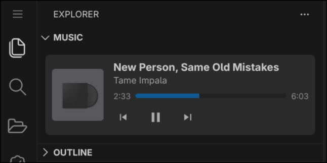

# MPRIS Music Control

A beautiful and lightweight music widget that allows you to control your system's media players directly from the sidebar of VSCodium and VS Code. Control your playback seamlessly without breaking your coding workflow.

<p align="center">
  
</p>

## 🌟 Features

- **Explorer Integration:** The player fits neatly right beneath your standard file explorer view.
- **Interactive Timeline:** Full support for tracking position and seeking through songs by clicking on the progress bar.
- **Adaptive Theme Styling:** Automatically inherits and adapts to your active VSCodium/VS Code color theme.
- **Placeholder:** Automatically falls back to a clean local asset image if a track lacks cover art or if the player is idle.
- **Universal Player Support:** Works with any media player adhering to the MPRIS specification (Spotify, VLC, Audacious, or YouTube/Yandex.Music, sources playing inside Firefox/Chromium-based browsers).

## 📦 System Requirements (Crucial)

To interface with the system D-Bus on Linux, this extension relies on the `playerctl` CLI tool.

Please ensure it is installed on your Linux machine before using the extension:

- **Ubuntu / Debian / Mint / Pop!\_OS:**
  ```bash
  sudo apt update && sudo apt install playerctl
  ```
- **Arch Linux / Manjaro:**
  ```bash
  sudo pacman -S playerctl
  ```
- **Fedora / RHEL:**
  ```bash
  sudo dnf install playerctl
  ```

## 🚀 Setup & Usage

1. Install the extension from the Open VSX Registry / VS Marketplace, or install it manually via a compiled `.vsix` file.
2. Open the **Explorer** tab on the left sidebar.
3. Look at the very bottom for the **Music (MPRIS)** panel.
4. Launch any media player on your system and play a track—the widget will instantly grab the album art, metadata, and live playback state.

## 🛠️ Local Development & Building

If you wish to compile the extension into a standalone `.vsix` file:

1. Install the required Node dependencies:
   ```bash
   npm install
   ```
2. Build the package for VSCodium (Open VSX):
   ```bash
   npx ovsx package
   ```
3. Build the package for the original VS Code distribution:
   ```bash
   npm install -g @vscode/vsce
   vsce package
   ```

## 📄 License

This project is licensed under the terms of the [MIT License](LICENSE). Copyright (c) 2026 [terabit-core].
